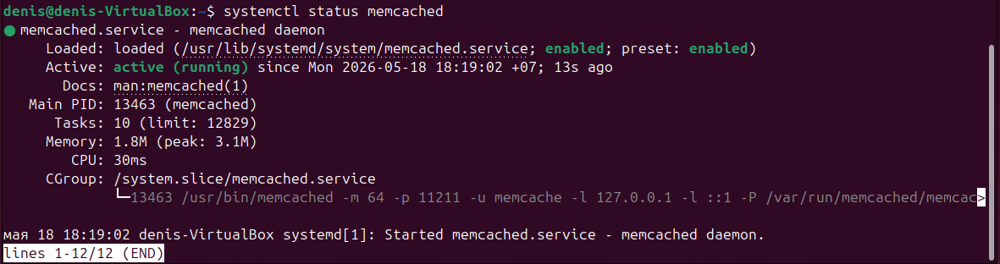
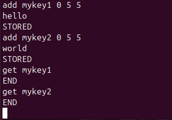
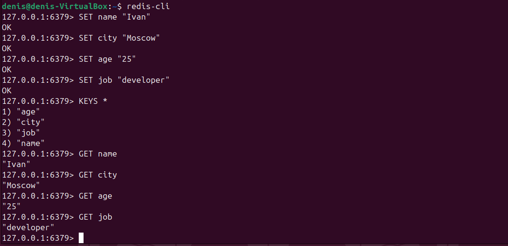

# Домашнее задание к занятию «Кеширование Redis/memcached» - Мурашов Денис

## Задание 1

1. Высокая нагрузка на БД - если одни и те же тяжелые SQL-запросы выполняются много раз в секунду, кеш позволяет выполнить запрос один раз и отдавать результат из памяти.
2. Медленный отклик API - результаты внешних API-запросов кешируются, чтобы не ждать ответа каждый раз.
3. Пики трафика - кеш снижает нагрузку на серверы при резком росте числа запросов.
4. Повторяющийся рендеринг страниц - HTML страниц кешируется, чтобы заново не генерировать их при каждом запросе.
5. DNS-запросы - DNS-кеш сокращает время резолвинга доменных имен.

## Задание 2

## Задание 3

## Задание 4

